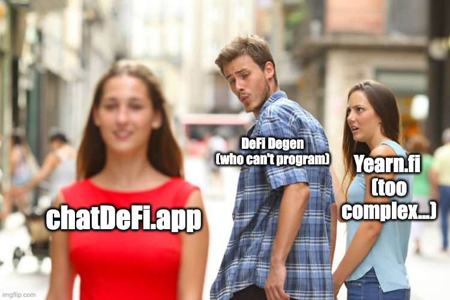
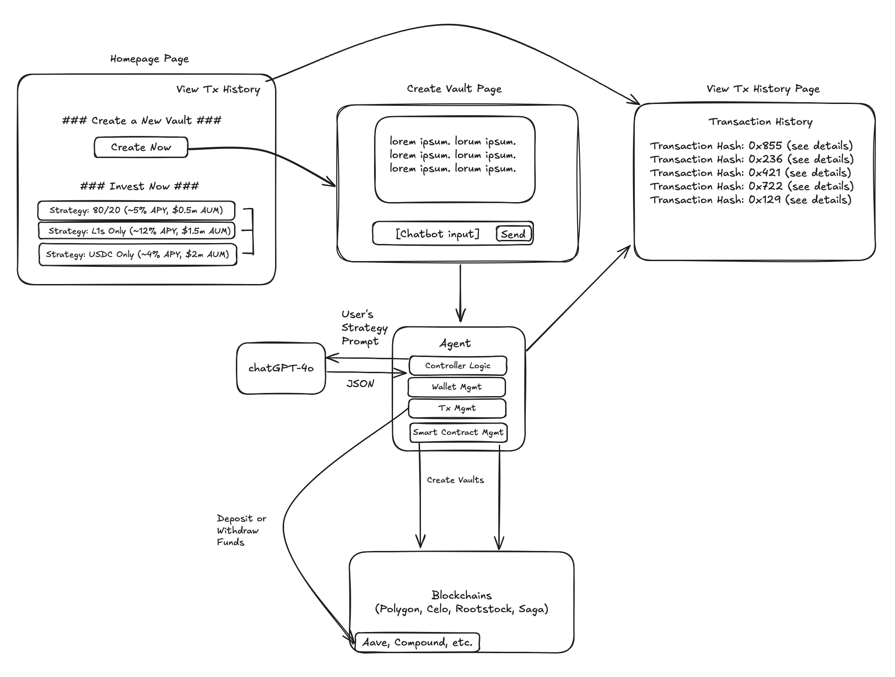

# Project Overview

The [chatDeFi.app](http://chatdefi.app) AI agent democratizes DeFi by enabling anyone to create, execute and manage DeFi investment strategies by simply typing in their desired DeFi investment strategy into a user-friendly chatbot interface. Our AI agent then executes these strategies automatically.

For example, you could instruct our AI agent to:

“Please allocate my wallet funds to the highest yielding DeFi lending pools that earn at least 5% APY. Also, to manage my risk, split my wallet funds across 2 lending pools with 70% of my funds in one pool and 30% in another. If my portfolio loses 10% of its funds, then stop managing my portfolio.”

Our AI agent will parse your natural language request into the corresponding DeFi strategy and actively manage and rebalance your portfolio according to the parameters you define.

Key Components
* Front-end:
  * [chatDeFi.app](http://chatdefi.app) houses the chatbot interface to enter in your desired DeFi strategy in plain english.
* Back-end: 
  * Our AI agent will process/interpret your strategy, manage your strategy vault  by depositing/withdrawing your vault funds to/from the approriate DeFi protocol according to your investment strategy parameters, and auto-stop if certain risk parameters are reached.

Key Features
* Blockchains supported: 
  * Celo, Polygon, Rootstock, Saga
* DeFi protocols supported: 
  * DeFi lending (i.e. Aave, Compound, etc. (varies by blockchain))
* Strategies supported: 
  * i) Portfolio allocation strategy (i.e. 80%/20% or 70/30% splits across x number of DeFi lending pools), 
  * ii) Risk management strategy (i.e. auto-stop AI agent if portfolio value falls 10%) 
  * iii) Min. Return requirements (i.e. only invest in pools with min. return of x%)

Future Roadmap
* Support additional DeFi protocols (DEX trading, perpetual trading, yield optimizers) 
* "Invest" feature - co-invest alongside an existing DeFi strategy (aka vault) on the platform (instead of creating your own DeFi investment)

Architecture

# Celo Prize Requirement Details
See [Readme (Celo deployment).md](./Readme%20(Celo%20deployment).md)

# Polygon Prize Requirement Details
See [Readme (Polygon deployment).md](Readme%20(Polygon%20deployment).md)

# Rootstock Prize Requirement Details
See [Readme (Rootstock deployment).md](./Readme%20(Rootstock%20deployment).md)

# Saga Prize Requirement Details
See [Readme (Saga deployment).md](./Readme%20(Saga%20deployment).md)
